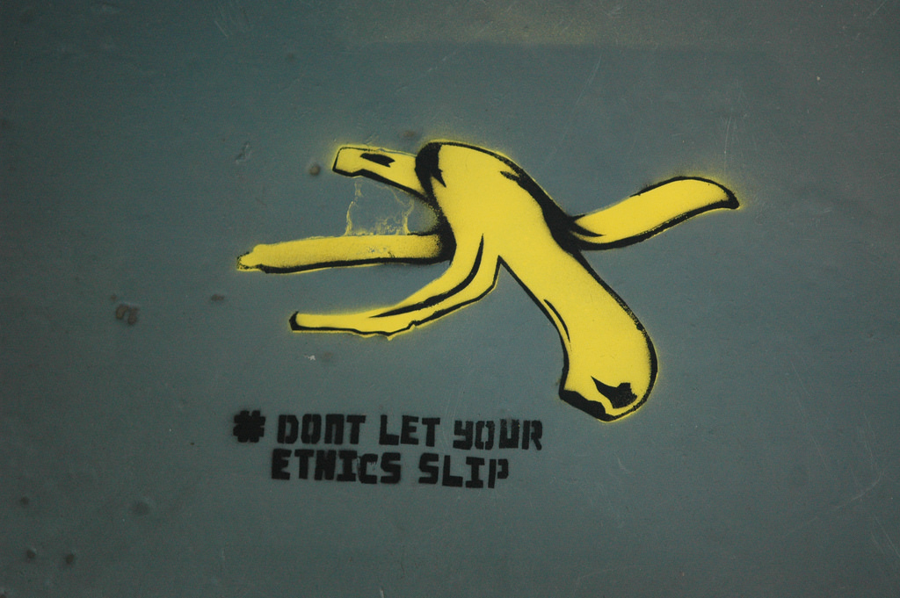

# Ethics for Digital Projects and Research 

Image source: [Flickr User We Are Neo "Don't Let Your Ethics Slip" 2014](https://www.flickr.com/photos/neocommunications/12947713033)

A discussion of ethics for digital projects and research within and beyond institutional compliance with an emphasis on consent, personhood, confidentiality, political economy, the politics of knowledge production, and accessibility. 

Introduction  

[Introduction](introduction.md)  

[Your Digital Work](your.md)  

[Workshop Goals](goals.md)  

[Institutional Ethics](institutional.md)  

[Belmont Report](belmont.md)  

[Institutional Review Board(IRB)](irb.md)  

[Ethics Beyond Compliance](beyond.md)

[Level of Impact #1](impact1.md)  

["Public" Data](public.md)  

[The Question of Personhood](personhood.md)  

[Level of Impact #2](impact2.md)  

[Examples](examples.md)  

[Level of Impact #3](impact3.md)  

[Range of Impact](range.md)  

[Case Examples](cases.md)

[Debrief](debrief.md)  

[Resources](resources.md)

  

******

[Begin >>>](introduction.md)