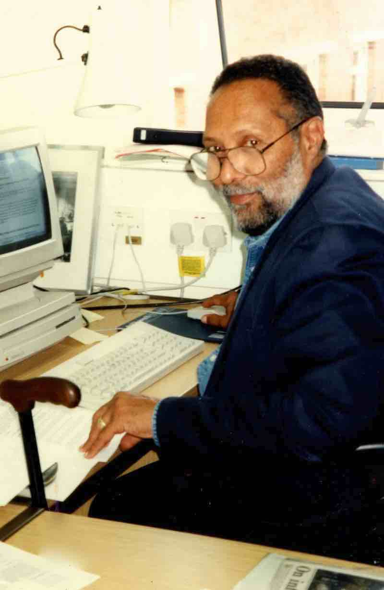
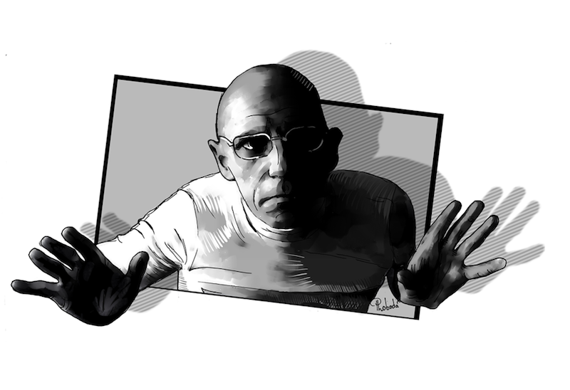

# Ethics beyond compliance

**Levels of impact:**
 
1. Direct impacts on people
2. Ramifications of (re)producing categories 
3. Political and economic effects 

& **Range of impact:** 
* Accessibility to your work

Source: [Annette Markham, “OKCupid data release fiasco: It’s time to rethink ethics education” (2016)](http://annettemarkham.com/2016/05/okcupid-data-release-fiasco-its-time-to-rethink-ethics-education/)

******

## Level of Impact #1

### … But what counts as human?  
### & what (personal) data should be off limits?
 
**Some commonly blurred definitions:**

* “Human subjects”
* Public vs. Private
* Data(Text) vs. Persons

Source: [the 2012 Ethical Decision-Making and Internet Research report by the the AoIR Ethics Working Committee](http://aoir.org/reports/ethics2.pdf)  

******

### Human subjects & the “distance principle”

A working definition of the “distance principle”:

**“the extent to which Internet texts or data sets might connect to persons”** even when “the conceptual or experiential distance between the researcher and author/participant [does not appear to be] close” (Markam & Buchanon, page 10)

Source: [Annette Markam & Elizabeth Buchanon, “Ethical Concerns in Internet Research”](https://www.academia.edu/8037870/Ethical_Concerns_in_Internet_Research)  

******

### “Public” data

  
Image source: Wikimedia Commons

“In an age of digital media, do we really have any privacy?” Is the internet itself a panopticon for the surveillance of our interactions? (Barnes)

What forms of “public” data are ethical to use? Or require attribution? 

How might we (inadvertently) share data?

  

Useful sources:
* [Gregory Donovan, MyDigitalFootprint.ORG](http://mydigitalfootprint.org/dissertation/)
* [Susan Barnes, “A Privacy Paradox” (2006)](http://firstmonday.org/article/view/1394/1312)  
* [Berendt, Büchler, & Rockwell, “Is it Research or is it Spying? Thinking-Through Ethics in Big Data AI and Other Knowledge Sciences” (2015)](http://digitalhumanitiesnow.org/2015/04/editors-choice-is-it-research-or-is-it-spying-thinking-through-ethics-in-big-data-ai-and-other-knowledge-sciences/)

******

### The question of personhood

  
Image source: [“An Avatar Forever Voyaging 051” Flickr user Torley, 2006](https://www.flickr.com/photos/torley/230596656/in/photostream/)

“Is an avatar a person?”
“Is one’s digital information an extension of the self?” (AoIR)

Source: [the 2012 Ethical Decision-Making and Internet Research report by the the AoIR Ethics Working Committee](http://aoir.org/reports/ethics2.pdf)

## Pause. 

Update our guidelines...

******

## Level of Impact #2
## Ramifications of (re)producing categories

Decisions on the categories & boundaries we use shape our:

* Datasets
* Algorithms
* Maps

Discuss: 
What is an example of a category or boundary you have to establish when making a dataset? Algorithm? map?

*… (re)producing definitional categories in our projects may have political or economic effects!*

******

### Politics of knowledge production

Some key theorists (among many more!) on how knowledge and power are mutually constituted:

**Antonio Gramsci**  
  
Image source: [Wikimedia, Public Domain](https://commons.wikimedia.org/wiki/File:Gramsci.png)

**Stuart Hall**  
  
Image source: ["Professor Stuart Hall," Flickr User The Open University, 2014](https://www.flickr.com/photos/the-open-university/15153440383/in/photostream/)

**Michel Foucault**  
  
Image source: [Wikimedia, Michel Foucault portrait by Paul Loboda be.net/Loboda_Paul, 2015](https://commons.wikimedia.org/wiki/File:Foucalt.png)

Some key terms:
* **Hegemony** (Gramsci)
* **Discourse** (Foucault)
* **"Policing the crisis"** (Hall)

Discuss: 
* *BRIEFLY,* how are knowledge and power mutually constituted, according to the theorizations of Gramsci, Hall or Foucault?
* What do the above key terms mean?

******

#### An example:

The hegemonic racial discourses that associate Blackness with criminality in the United States serve to justify police brutality towards and higher rates of criminalization and mass incarceration of Black people - and these higher rates of policing and incarcerating serve to justify the assumption of their criminality.

So then when, for eample, someone attempts to make an algorithm to identify potential criminals that is produced through machine learning on crime data (e.g. the number of accused crimes in relation to demographic data) that algorithm will reproduce the racist ideologies and practices that police and incarcerate Black people at a much higher rate - an example we will discuss more later.

Further reading: [Julia Angwen & Jeff Larson, "Bias in Criminal Risk Scores Is Mathematically Inevitable, Researchers Say"](https://www.propublica.org/article/bias-in-criminal-risk-scores-is-mathematically-inevitable-researchers-say)

******

#### Another example:

  
Image source: A comic by Adeline Koh from [#DHPoco: Postcolonial Digital Humanities](http://dhpoco.tumblr.com/), shared here with her permission. 

Categories are key to digital tools in many ways - the organizational systems used by libraries and archives, the tags used on websites, the methods of categorization informing algorithms - which then shapes not only how things/people/etc are grouped together but what is searchable and findable, and the trajectory of canon formation and what is cited and foregrounded.

... What might be another example of how knowledge is politicized in a digital project?

******

## Level of Impact #3
## Political & economic impacts

  

Some questions to consider:

* Whose **labor** and what **materials** are used to make the digital tools you use?
* Could your research or project be used to justify or facilitate **state control** or **surveillance**?  
* Could it influence **political discourse**? Modes of **profit**?

******

## Range of Impact
## Accessibility to your work 

  
Image source: [Creative Commons](https://creativecommons.org/choose/)

Why use or produce open source tools? Or [creative commons](https://creativecommons.org/) materials?

Have you considered issues of digital accessibility for differently abled and language-speaking individuals?  
*For the latter group, beware of Google translate...*

Some sources to check out:

* Scott Dexter’s book, [Decoding Liberation: The Promise of Free and Open Source Software](http://www.sci.brooklyn.cuny.edu/~bcfoss/DL/)
* [Dr. Joshua Miele’s](http://www.ski.org/users/joshua-miele) work on digital accessibility - see a review of his GC talk by Nanyamkah Mars [here](http://dh.prattsils.org/blog/resources/event-reviews/digital-accessibility-and-the-making-of-a-meta-maker-movement-a-talk-by-dr-joshua-miele-hosted-by-gc-digital-initiatives-at-the-graduate-center-cuny-on-thursday-october-20-2016/)

## Pause. 

Update our guidelines...

******

