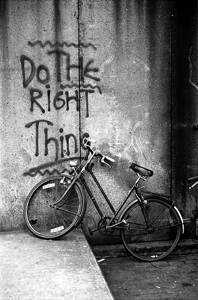

# Introduction

## What are ethics?

n. Moral principles, or a system of these.
	~Oxford English Dictionary Online

"Situated" ethics (drawing from Donna Haraway, "Situated Knowledges," 1988):  
a person's understandings of and commitments to ethics / morality are greatly linked to their own experiences, positionalities, and political orientations 

## What do we mean by digital projects and research?

Projects or research that engages with the digital - i.e. that examines, uses or creates digital tools or platforms.

******

## Our approach to ethics

 
> **“Do the right thing”**  

  
> **Keep questioning**

  
> **Levels of impact** 
1. Direct impacts on people
2. Ramifications of (re)producing categories
3. Political and economic effects
& Range of Impact 
-- Accessibility to your work

Source: [Annette Markham, “OKCupid data release fiasco: It’s time to rethink ethics education” (2016)](http://annettemarkham.com/2016/05/okcupid-data-release-fiasco-its-time-to-rethink-ethics-education/)   

******

## Your digital work

Ethical concerns vary between people, disciplines, projects and tools. 

Introduce yourself to the person next to you:
* Name
* Program
* Current or upcoming digital research or projects? 
* Digital tools that you use?
* Ethical concerns?

Then introduce that person to the group.

******

## Workshop goals

We will:
* **consider** ethical practices to satisfy institutional needs (IRB) and working with “human subjects,”
* **create** a working set of guidelines for ethical research,
* **explore** ethical questions when doing various forms of digital research and using digital tools,
* **discuss** the ethics of example projects and methodologies,
* **envision and elaborate** on our own ideas and concerns!

*Note: We will create the aforementioned working set of guidelines in a shared google doc. The workshop leader will create the google doc and share its link with participants. Each participant may add to the doc and write their name or alias down as a contributor, or choose to opt out. This doc will be a space for us throughout this workshop to share notes and additional resources.* 

