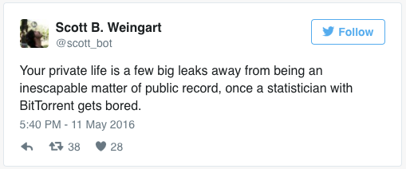

### “Public” data

  
Image source: Wikimedia Commons

“In an age of digital media, do we really have any privacy?” Is the internet itself a panopticon for the surveillance of our interactions? (Barnes)

What forms of “public” data are ethical to use? Or require attribution? 

How might we (inadvertently) share data?

  

Useful sources:
* [Gregory Donovan, MyDigitalFootprint.ORG](http://mydigitalfootprint.org/dissertation/)
* [Susan Barnes, “A Privacy Paradox” (2006)](http://firstmonday.org/article/view/1394/1312)  
* [Berendt, Büchler, & Rockwell, “Is it Research or is it Spying? Thinking-Through Ethics in Big Data AI and Other Knowledge Sciences” (2015)](http://digitalhumanitiesnow.org/2015/04/editors-choice-is-it-research-or-is-it-spying-thinking-through-ethics-in-big-data-ai-and-other-knowledge-sciences/)

******

[<<< Back](impact1.md) - [Next >>>](personhood.md)