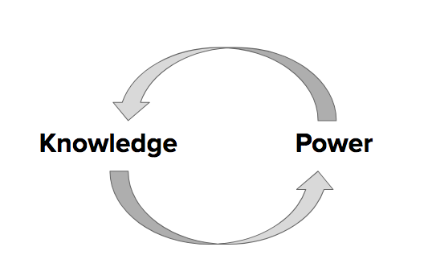

# Level of Impact #2

## Politics of knowledge production

> "At another level, we can ask how our methods of organizing data, analytical interpretations, or findings as shared datasets are being used — or might be used — **to build definitional categories or to profile particular groups** in ways that could impact livelihoods or lives. Are we contributing positive or negative categorizations?" [Annette Markham, "OKCupid data release fiasco: It’s time to rethink ethics education," 2016](http://annettemarkham.com/2016/05/okcupid-data-release-fiasco-its-time-to-rethink-ethics-education/), emphasis added)  

## Discuss

* *BRIEFLY,* how are knowledge and power mutually constituted, according to the theorizations of Gramsci, Hall or Foucault?
* What do the key terms below mean?  
* How might we apply these concepts when thinking through ethics for digital research and projects?  

Some key terms:  

* **Hegemony** (Antonio Gramsci)
* **Discourse** (Michel Foucault)
* **"Policing the crisis"** (Stuart Hall)

An example:  

The hegemonic racial discourses that associate Blackness with criminality in the United States serve to justify police brutality towards and higher rates of criminalization and mass incarceration of Black people - and these higher rates of policing and incarcerating serve to justify the assumption of their criminality.

So then when, for eample, someone attempts to make an algorithm to identify potential criminals that is produced through machine learning on crime data (e.g. the number of accused crimes in relation to demographic data) that algorithm will reproduce the racist ideologies and practices that police and incarcerate Black people at a much higher rate.

Further reading: [Julia Angwen & Jeff Larson, "Bias in Criminal Risk Scores Is Mathematically Inevitable, Researchers Say"](https://www.propublica.org/article/bias-in-criminal-risk-scores-is-mathematically-inevitable-researchers-say)  

## Ramifications of (re)producing categories

Decisions on the categories and boundaries scholars use shape our:

* Datasets
* Algorithms
* Maps

  
Image source: A comic by Adeline Koh from [#DHPoco: Postcolonial Digital Humanities](http://dhpoco.tumblr.com/), shared here with her permission.  

Categories are key to digital tools in many ways - the organizational systems used by libraries and archives, the tags used on websites, the methods of categorization informing algorithms - which then shapes not only how things/people/etc are grouped together but what is searchable and findable, and the trajectory of canon formation and what is cited and foregrounded.  

## Attempts to "resist the hierarchy"  

Can categorical hierarchies be resisted through digital projects?  

Check out the [Interference Archive](http://interferencearchive.org/) - a local archive in Brooklyn that aims to "resist the hierarchy," as discussed in [this brief article](http://technical.ly/brooklyn/2016/11/28/interference-archive-activism-jen-hoyer/%20). *Fun fact: I helped paint that #NoDAPL banner - with others at [Decolonize this Place](http://www.decolonizethisplace.org/) - shown in the article's first photo.*  

Relatedly, might public syllabi projects - e.g. the [#StandingRockSyllabus](https://nycstandswithstandingrock.wordpress.com/standingrocksyllabus/) - also be understood as "resisting the hierarchy," or specifically resisting the canonization of Western white settler colonial approaches? 

## Activity: Think, Pair, Share

Think about the digital project or research you are or will be working on.

1. What is an example of a category or boundary you have to establish when making a dataset, algorithm, or map?  
* Are you basing the categor(y/ies) or boundar(y/ies) you use off already established ones? Established by who? Where?  
* If you are establishing your own categor(y/ies) or boundar(y/ies), what decisions did or do you have to make?  

2. What may be some of the possible social, political or economic effects of creating or re-creating these categories or boundaries?  

Pair up with another person near you and discuss. Share as a class.   

******

[<<< Back](impact1cont.md) - [Next >>>](impact3.md)